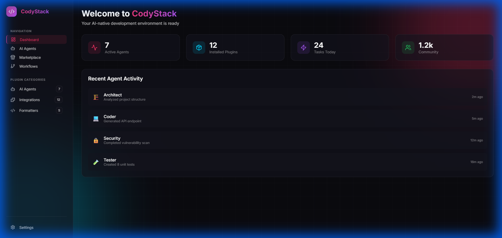
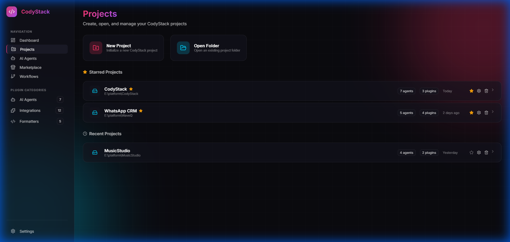
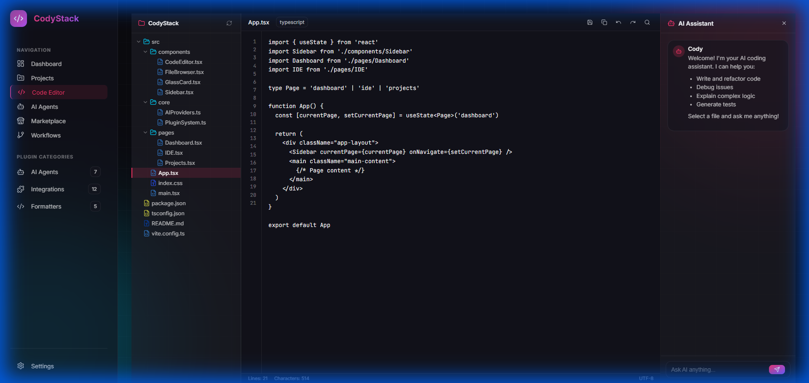
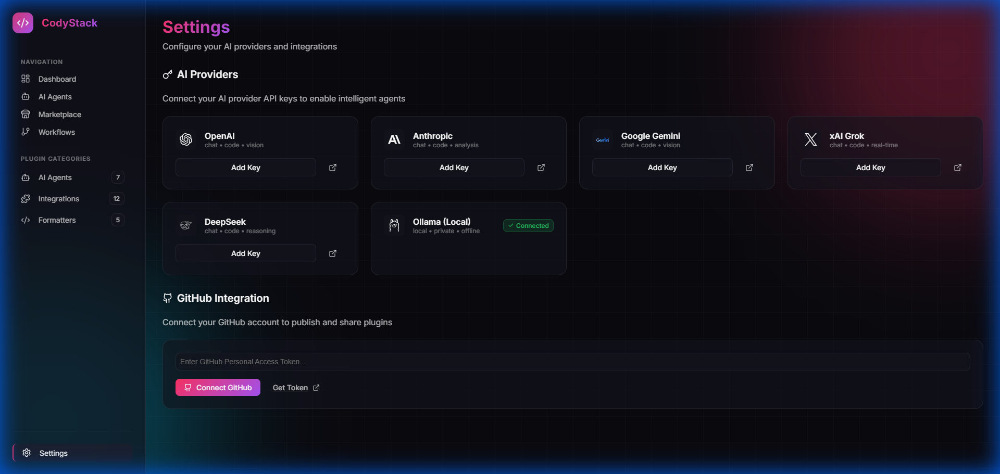
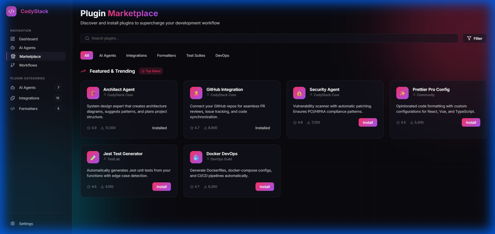
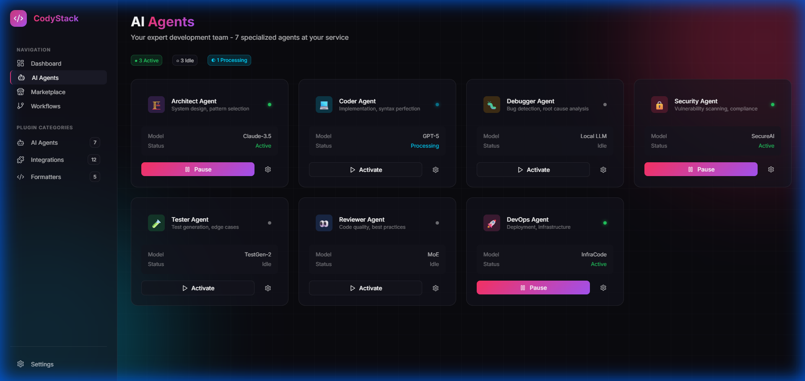

<p align="center">
  
</p>

<h1 align="center">🚀 CodyStack</h1>

<p align="center">
  <strong>AI-Native IDE with Multi-Agent Orchestration</strong><br/>
  <em>Your Expert Dev Team Inside Your Editor</em>
</p>

<p align="center">
  <a href="#-features">Features</a> •
  <a href="#-quick-start">Quick Start</a> •
  <a href="#-ai-providers">AI Providers</a> •
  <a href="#-plugin-system">Plugins</a> •
  <a href="#-contributing">Contributing</a> •
  <a href="#-community">Community</a>
</p>

<p align="center">
  
  
  
  
  
</p>

<p align="center">
  
  
  
</p>

---

## 🎯 What is CodyStack?

**CodyStack** is not just another IDE plugin - it's an **AI-native development environment** where multiple specialized AI agents collaborate in real-time, orchestrated to handle complex development workflows end-to-end.

Think of it as having an **entire expert team** inside your editor:

| Agent             | Specialization               | Superpower                               |
|-------------------|------------------------------|------------------------------------------|
| 🏗️ **Architect** | System design, patterns      | Architecture diagrams, dependency graphs |
| 💻 **Coder**      | Implementation, syntax       | Production-ready code                    |
| 🐛 **Debugger**   | Bug detection, root cause    | Fix suggestions with causality chains    |
| 🔒 **Security**   | Vulnerability scanning       | Audit reports, automatic patches         |
| 🧪 **Tester**     | Test generation, edge cases  | Test suites, coverage reports            |
| 👀 **Reviewer**   | Code quality, best practices | PR-style reviews, refactor suggestions   |
| 🚀 **DevOps**     | Deployment, infrastructure   | Dockerfiles, CI/CD, K8s configs          |

---

## 📸 Screenshots

<p align="center">
  
  
</p>
<p align="center">
  
  
</p>
<p align="center">
  
  
</p>

---

## ✨ Features

### 🔌 Pluggable Architecture
Build and share your own plugins! CodyStack's extensible plugin system lets you:
- Create custom AI agents with any model
- Add integrations with your favorite tools
- Share workflows with the community
- Install plugins from the marketplace

### 🎨 GlassMorphic Premium UI
A stunning, modern interface with:
- Frosted glass effects & animated gradients
- Dark mode optimized for long coding sessions
- Corporate Cyberpunk aesthetic
- Responsive design

### 🤖 Multi-Model AI Router
Intelligently routes tasks to the best AI model:
- **Privacy-first**: Local models (Ollama) for sensitive code
- **Reasoning-heavy**: Claude for architecture decisions
- **Code-optimized**: DeepSeek for implementation
- **Multimodal**: Gemini for vision tasks

### 📁 Project-Based Configuration
Each project gets a `.codystack/` folder (like `.git/`) containing:
- Local plugin configurations
- Agent preferences
- Workflow templates
- Cached data

### 🔄 Workflow Orchestration
Chain agents with approval gates:
```
Feature Request → [Architect] → [Coder] → [Security] → ⚠️ Human Checkpoint → [Tester] → [DevOps]
```

---

## 🤖 AI Providers

Connect your favorite AI providers with a single API key:

| Provider                                                                                                    | Models                  | Best For                         |
|-------------------------------------------------------------------------------------------------------------|-------------------------|----------------------------------|
|  **OpenAI**       | GPT-4o, o1-preview      | General, testing                 |
|  **Anthropic** | Claude 3.5 Sonnet, Opus | Architecture, security           |
|  **Google Gemini**                | Gemini 2.0 Flash, Pro   | Multimodal, fast tasks           |
|  **xAI Grok**          | Grok-2                  | Real-time data                   |
|  **DeepSeek**      | DeepSeek Coder          | Code generation (cost-effective) |
|  **Ollama**       | Llama 3.2, CodeLlama    | Local/private code               |

---

## 🚀 Quick Start

```bash
# Clone the repository
git clone https://github.com/LebToki/CodyStack.git
cd CodyStack

# Install dependencies
npm install

# Start development server
npm run dev
```

Open [http://localhost:5173](http://localhost:5173) and start exploring!

---

## 🔌 Plugin System

### Plugin Categories

| Category            | Description               | Examples                      |
|---------------------|---------------------------|-------------------------------|
| 🤖 **AI Agents**    | Specialized AI assistants | Architect, Debugger, Security |
| 🔗 **Integrations** | Connect external services | GitHub, Slack, Stripe         |
| 📝 **Formatters**   | Code styling tools        | Prettier, ESLint configs      |
| 🧪 **Test Suites**  | Testing frameworks        | Jest, Playwright, Cypress     |
| 🚀 **DevOps**       | Deployment tools          | Docker, K8s, CI/CD            |
| 🎨 **Themes**       | UI customization          | Dark variants, color schemes  |

### Creating a Plugin

```typescript
// my-plugin/index.ts
import { createPlugin } from '@codystack/core';

export default createPlugin(
  {
    id: 'my-awesome-plugin',
    name: 'My Awesome Plugin',
    version: '1.0.0',
    category: 'integrations',
    author: { name: 'Your Name' }
  },
  {
    onActivate: async (context) => {
      context.log('Plugin activated! 🎉');
      
      context.registerCommand({
        id: 'my-command',
        title: 'Do Something Cool',
        handler: async () => {
          // Your magic here
        }
      });
    }
  }
);
```

📚 [Full Plugin Development Guide →](docs/PLUGIN_DEVELOPMENT.md)

### Community Plugin Registry

- **Publish** your plugins to the community marketplace
- **Version tracking** with automatic update notifications
- **Approval system** for security and quality assurance
- **GitHub integration** for one-click publishing

---

## 🏗️ Architecture

```
CodyStack/
├── src/
│   ├── core/
│   │   ├── PluginSystem.ts       # Plugin interfaces
│   │   ├── PluginRegistry.ts     # Lifecycle management
│   │   ├── PluginRemoteRegistry.ts # Community plugins
│   │   ├── ProjectSystem.ts      # .codystack/ folder
│   │   ├── AIProviders.ts        # Multi-model router
│   │   └── GitHubPublisher.ts    # Plugin publishing
│   ├── components/               # React UI components
│   ├── pages/                    # App pages
│   └── index.css                 # GlassMorphic theme
├── plugins/                      # Example plugins
└── docs/                         # Documentation
```

---

## 🤝 Contributing

We love contributions from the community! Here's how you can help:

### Ways to Contribute

- 🐛 **Report Bugs**: Found something broken? [Open an issue](https://github.com/LebToki/CodyStack/issues)
- 💡 **Suggest Features**: Have an idea? Let's discuss it!
- 🔌 **Build Plugins**: Create and share your own plugins
- 📖 **Improve Docs**: Help others get started faster
- ⭐ **Star the Repo**: Show your support!

### Development Setup

```bash
# Fork and clone
git clone https://github.com/YOUR_USERNAME/CodyStack.git

# Create a branch
git checkout -b feature/amazing-feature

# Make changes and commit
git commit -m "Add amazing feature"

# Push and create PR
git push origin feature/amazing-feature
```

---

## 👥 Community

Join our growing community of developers building the future of AI-assisted coding!

<p align="center">
  <a href="https://github.com/LebToki/CodyStack/discussions">
    
  </a>
  <a href="https://twitter.com/2abortar">
    
  </a>
  <a href="https://github.com/LebToki">
    
  </a>
</p>

### 🏆 Hall of Fame

Special thanks to our contributors:

<!-- CONTRIBUTORS_START -->
<table>
  <tr>
    <td align="center">
      <a href="https://github.com/LebToki">
        
        <br /><sub><b>Tarek Tarabichi</b></sub>
      </a>
      <br />💻 🎨 📖
    </td>
  </tr>
</table>
<!-- CONTRIBUTORS_END -->

---

## � Roadmap

- [x] Core plugin architecture
- [x] GlassMorphic UI
- [x] Multi-AI provider support
- [x] GitHub publisher
- [ ] File browser component
- [ ] Workflow visual builder
- [ ] Native desktop app (Tauri)
- [ ] Plugin CLI scaffolding tool
- [ ] VS Code extension

---

## �📜 License

MIT © [Tarek Tarabichi](https://github.com/LebToki) / [2TInteractive](https://2tinteractive.com)

---

<p align="center">
  
</p>

<p align="center">
  <strong>Built by Tarek Tarabichi @ 2TInteractive</strong><br/>
  <em>Cashflow Over Clout 🚀</em>
</p>

<p align="center">
  <sub>If this project helped you, consider giving it a ⭐</sub>
</p>
